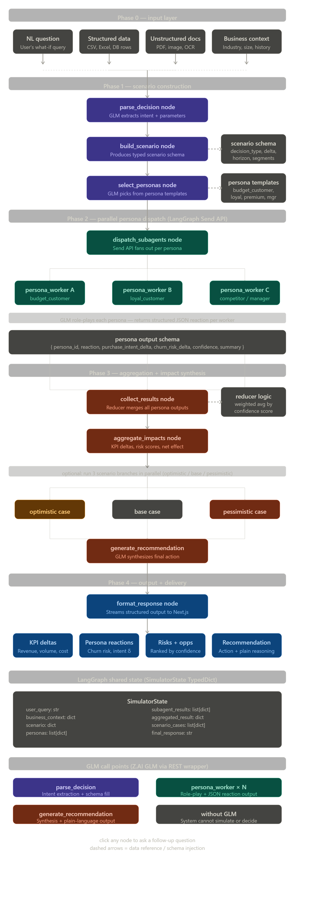

## Phase 0 — Input Layer

Four input types feed the system: the user's natural language question, structured data (CSV/Excel), unstructured documents (PDF/image/OCR), and business context. All four converge into the first LangGraph node. This is where your FastAPI endpoint receives the POST body and initialises the `SimulatorState`.

---

## Phase 1 — Scenario Construction (3 nodes)

`parse_decision` → `build_scenario` → `select_personas`

This is the first place GLM gets called. `parse_decision` uses GLM to extract decision type, delta value, time horizon, and target segments from the user's natural language input and return a typed scenario schema. `build_scenario` fills the full schema object and locks it into state. `select_personas` uses GLM (or rule-based logic for speed) to pick which persona templates apply to this scenario — not generate them from scratch.

---

## Phase 2 — Parallel Dispatch (LangGraph Send API)

`dispatch_subagents` → `persona_worker × N` (parallel)

This is the core of your architecture. The Send API fans out to N persona workers simultaneously — each worker gets the same scenario schema but reasons from a different identity. GLM role-plays each persona and must return structured JSON, not prose. This is critical for Phase 3 to work cleanly. Each worker is bounded by your token/recursion limits here.

---

## Phase 3 — Aggregation + Synthesis (4 nodes)

`collect_results` → `aggregate_impacts` → optional 3-case branch → `generate_recommendation`

The reducer collects all persona JSON outputs and merges them using a weighted average by confidence score. `aggregate_impacts` computes net KPI deltas. Optionally, you then fan out again to three scenario branches (optimistic/base/pessimistic), run lightweight GLM inference on each, then fan back in. `generate_recommendation` is the final GLM call — it takes the full aggregated picture and writes the plain-language output with assumptions, reasoning, and action.

---

## Phase 4 — Output Layer

`format_response` → streams to Next.js

The final node formats everything into four output blocks: KPI deltas, persona reactions, ranked risks/opportunities, and the recommendation. This streams via FastAPI SSE to your Next.js frontend so the demo *looks alive* as it runs.

---

## Build Order Recommendation (phases as milestones)

| Milestone | What to build | Risk |
|---|---|---|
| M1 | State schema + `parse_decision` with GLM | Low — test GLM API first |
| M2 | `build_scenario` + `select_personas` + 3 hardcoded templates | Low |
| M3 | Send API fan-out + 3 persona workers returning JSON | Medium |
| M4 | Reducer + `aggregate_impacts` | Medium |
| M5 | 3-case branching (optimistic/base/pessimistic) | Medium |
| M6 | `generate_recommendation` + Next.js streaming output | Low-Medium |

Start with M1 immediately — until you know exactly how Z.AI GLM's API behaves, everything else is assumption. Want me to draft the actual Python node implementations starting from M1?