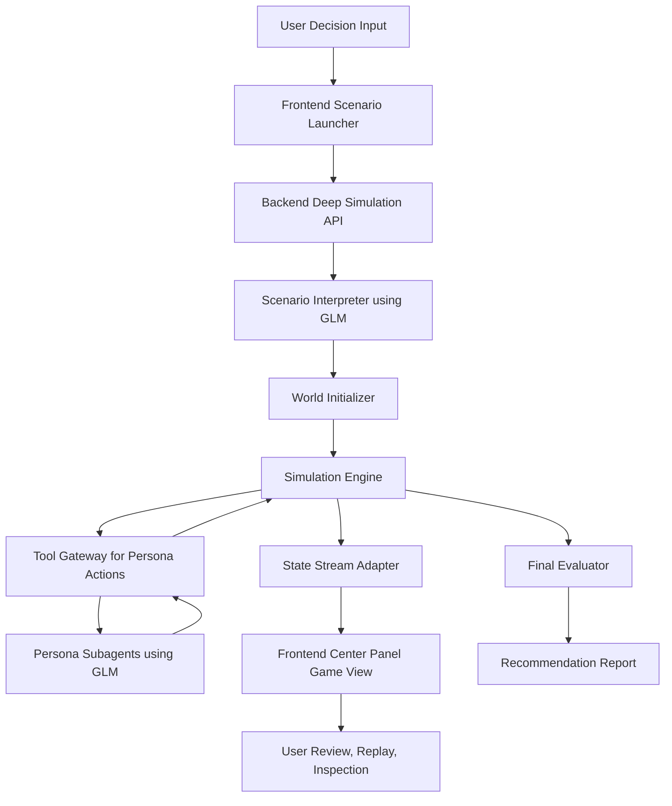

# Deep Simulation Real Game Plan

## Goal

Turn the center panel of the deep simulation arena into a real AI Town-inspired simulation surface backed by authoritative game state, legal game actions, and deterministic resolution. The result should no longer be a decorative map with transcripts layered on top; it should be a live game client for a backend simulation engine where persona subagents inhabit a business-world map, observe conditions, interact, take actions, and change measurable outcomes.

This plan is scoped to the hackathon problem statement: AI-powered decision intelligence for economic empowerment. The game layer exists to make multi-agent reasoning inspectable, replayable, and measurable, not to add arcade mechanics.

## Product Definition

### What This Is

- A multi-agent business-world simulation inspired by AI Town
- A decision lab where persona subagents live in zones, react to events, talk, and execute actions
- A measurable validation environment for testing strategies such as pricing, cost control, or operational tradeoffs

### What This Is Not

- A fake UI with animated icons and chat bubbles
- A city builder like SimCity
- A pure dashboard with no enforceable simulation rules

## Target User and Use Case

### Primary User

- SME owner, operator, strategist, or hackathon judge evaluating an economic decision

### Core Use Case

- User enters a business decision such as `Should we increase student prices by 10% next quarter?`
- GLM interprets the question plus structured/unstructured business context
- The system creates a simulated business world with personas, zones, pressures, and action tools
- Personas play through the scenario inside the game world
- The system returns measurable outcome deltas, tradeoff analysis, and a recommendation with explanation

## Success Criteria

- The center panel reflects authoritative simulation state from the backend
- Persona agents act through structured game tools, not only freeform transcript generation
- Each tick produces observable changes in world state, KPI tracks, and persona standings
- The final output includes measurable impact such as KPI deltas, score changes, and recommended strategy
- Removing the GLM materially degrades persona generation, reasoning quality, and recommendation quality

## Current State

### Frontend

- `frontend/src/components/simulator/deep/DeepSimulationSection.tsx`
  - Renders a stylized board and agent tokens
  - Displays transcripts, tool calls, and scoreboards
  - Consumes streamed world events
- The current board is visually rich but mechanically thin from the user's perspective

### Backend

- `backend/deep_simulation_agent/src/schema.py`
  - Already defines world map, zones, agents, personas, intents, timeline, and scores
- `backend/deep_simulation_agent/src/engine.py`
  - Already supports tick-based movement, zone effects, crisis cards, resolved intents, and scoring
- The engine already contains the beginnings of a real game, but the action model is still too coarse and the UI does not present it as a true game loop

## Recommended Game Model

### Genre

- `AI Town-inspired business-world simulation`

### Core Design Principle

- Every zone provides context
- Every persona has a point of view
- Every action has consequences
- Every tick updates measurable outcomes

### Recommended Play Style

- Cooperative with role tension

All personas contribute to the same overall business outcome, but each role optimizes differently. This creates useful disagreement without collapsing into sabotage.

## Real Game Requirements

The center panel qualifies as a real game only if these are true:

- There is a canonical backend-owned world state
- Agents can only change the world through legal game actions
- Actions are validated and resolved by rules
- Scores and KPIs update from actual resolution logic
- The UI visualizes real state transitions and history
- A finished run can be replayed and explained

If any of those are missing, the board remains mostly decorative.

## Core World Design

### Zones

Start with 6 to 8 business-world zones. Recommended v1:

- `Market Square` for demand and customer sentiment
- `Campus District` for student segment and pricing sensitivity
- `Retail Lane` for channel execution and sell-through
- `Operations Yard` for capacity and feasibility
- `Finance Tower` for margin, budget, and cost control
- `Brand Studio` for trust, positioning, and long-term equity
- `Competitor Watch` for external response and retaliation
- `Compliance Gate` for regulatory and policy risk

### World State

Canonical state should include:

- current tick and current phase
- map zones and adjacency or loop order
- persona positions
- company KPIs: revenue, margin, sentiment, churn risk
- persona scores
- trust and friction between personas
- pending actions
- resolved actions
- active event or crisis card
- recent conversation log
- replayable tick history

## Agent Model

Each persona should have:

- role
- objective
- constraints
- risk tolerance
- trust/reputation values toward other personas
- local memory
- available tools
- score based on mandate alignment and world contribution

Recommended initial personas:

- Pricing Strategist
- Consumer Psychologist
- Operations Lead
- Brand Lead
- Market Risk Analyst

## Game Loop

Each tick represents one simulated day.

### Tick Phases

1. `World Phase`
   - draw or emit market pressure, event, or crisis
2. `Observe Phase`
   - personas inspect global state, local zone state, and recent history
3. `Social Phase`
   - personas talk, warn, support, oppose, or persuade
4. `Action Phase`
   - personas submit structured legal actions
5. `Resolution Phase`
   - engine validates and applies consequences
6. `Scoring Phase`
   - company KPIs and persona scores update
7. `Summary Phase`
   - stream a compact explanation of what changed and why

## Legal Action System

Replace the broad intent-only model with a constrained game toolset.

### Recommended v1 Tools

- `move_to_zone(zone_id)`
- `inspect_zone(zone_id)`
- `inspect_agent(agent_id)`
- `talk_to_agent(target_id, stance, message)`
- `propose_action(action_type, args)`
- `support_action(action_id)`
- `oppose_action(action_id)`
- `commit_budget(amount, purpose)`
- `end_turn()`

### Recommended Strategic Action Types

- `price_adjust`
- `campaign`
- `spend_shift`
- `procurement`
- `retention_offer`
- `wait`

### Constraints

- one move action per tick
- one social action per tick
- one strategic action per tick
- illegal actions return structured rejection reasons

## Scoring Model

Use two scoring layers.

### 1. Deterministic Rules Score

Backed by engine logic:

- KPI deltas
- action success or failure
- zone bonuses
- crisis mitigation
- timing efficiency
- resource usage

### 2. Bounded LLM Score

Backed by GLM evaluation within strict rubric:

- strategic coherence
- role alignment
- quality of persuasion
- handling of uncertainty
- quality of explanation

### Final Outcome

The system should report both:

- `company outcome`
- `persona outcome`

This prevents flattening everything into one misleading score.

## App Flow

### 1. Scenario Input

- User enters decision question
- Optional structured data and documents are attached

### 2. Scenario Interpretation

- GLM extracts decision type, segment, uncertainty, and constraints
- System chooses or generates personas and world configuration

### 3. Simulation Setup

- Engine initializes zones, KPIs, persona state, event deck, and action constraints

### 4. Live Simulation

- Personas act through tools
- Engine resolves each phase
- UI streams and renders real game state

### 5. Review and Outcome

- Final recommendation
- KPI deltas
- persona rankings
- key turning points
- replayable timeline and explanation

## Center Panel UX

The center panel should become a real game view with clear state and phase visibility.

### Required Elements

- zone board with clear tile semantics
- persona tokens at real positions
- current tick and phase banner
- active event or crisis card
- pending action queue
- resolved action feed
- visible support or opposition links between personas
- selected persona inspector
- latest KPI and score deltas

### UX Principle

The board should prioritize legibility over spectacle. AI Town is a useful reference for “live world presence,” but this product needs business clarity first.

## Technical Architecture

## Backend Work Plan

### Phase 1: Formalize Canonical Game State

- extend world state to include explicit phase, pending actions, resolved actions, trust graph, and event card state
- separate display-friendly data from internal resolution data
- define a stable stream event schema for board updates

### Phase 2: Introduce Tool-Driven Action Execution

- replace or wrap `submit_action_intent` with legal game tools
- implement validation and rejection reasons
- persist action records with actor, target, phase, result, and score contribution

### Phase 3: Add Social Resolution

- model support, opposition, and persuasion effects
- add trust and friction deltas between personas
- include conversation summaries in world state

### Phase 4: Tighten Scoring

- formalize deterministic rule scoring
- add bounded LLM scoring rubric
- emit explainable score breakdowns

## Frontend Work Plan

### Phase 1: Convert the Board into a Real Game Surface

- redesign the center panel around zones, phase state, and action queue
- remove purely decorative board metaphors that do not map to engine logic
- keep transcript secondary to game state

### Phase 2: Visualize Real Actions

- animate movement from actual position changes
- render support and opposition edges
- render pending and resolved action cards
- show active event or crisis overlays

### Phase 3: Improve Inspection

- selected persona details
- zone inspector
- tick replay controls
- score delta breakdown

## Suggested File-Level Change Areas

### Frontend

- `frontend/src/components/simulator/deep/DeepSimulationSection.tsx`
  - split into board view, phase rail, action queue, and persona inspector
- new files recommended:
  - `frontend/src/components/simulator/deep/GameBoard.tsx`
  - `frontend/src/components/simulator/deep/PhaseRail.tsx`
  - `frontend/src/components/simulator/deep/ActionQueue.tsx`
  - `frontend/src/components/simulator/deep/PersonaInspector.tsx`
  - `frontend/src/components/simulator/deep/types.ts`

### Backend

- `backend/deep_simulation_agent/src/schema.py`
  - add phase, action record, relationship state, and richer event types
- `backend/deep_simulation_agent/src/engine.py`
  - introduce phase-based loop and tool-driven action resolution
- `backend/deep_simulation_agent/src/stream_adapter.py`
  - stream explicit game-state deltas for the UI
- new files recommended:
  - `backend/deep_simulation_agent/src/actions.py`
  - `backend/deep_simulation_agent/src/relationships.py`
  - `backend/deep_simulation_agent/src/scoring.py`

## MVP Scope

Ship this first before attempting richer AI Town behavior:

- 6 to 8 zones
- 4 to 5 personas
- strict turn phases
- move, inspect, talk, propose, support, oppose, end_turn tools
- deterministic rules scoring
- one active event or crisis card per tick
- replayable tick history
- final recommendation and KPI summary

## Validation Plan

For the hackathon, validation should be scenario-based and measurable.

### Required Demonstrations

- one pricing scenario
- one cost-control scenario
- one risk or volatility scenario

### Metrics to Show

- KPI improvement versus baseline
- time to recommendation
- number of alternatives explored
- role conflict surfaced and resolved
- recommendation explanation quality

## Risks

### Product Risk

- Overbuilding visual complexity before finalizing game rules

### Technical Risk

- Letting freeform LLM behavior bypass legal action constraints

### UX Risk

- Making the center panel visually impressive but hard to understand

### Scope Risk

- Trying to build full AI Town social depth in v1

## Non-Goals for v1

- open-world free roaming
- complex pathfinding
- fully emergent long-term memory system
- user-controlled avatar
- 3D or heavy sprite animation

## Recommended Delivery Order

1. formalize canonical state and turn phases
2. define legal game tools and action resolution
3. stream structured game events
4. refactor center panel into a real board view
5. add support and opposition interactions
6. add score explanations and replay
7. add bounded LLM judging for soft evaluation

## Review Questions

- Is the target mode `spectator-only` for v1, or should the user be able to inject events?
- Do we want a loop board or a district map with adjacency?
- Should persona conflict be cooperative-with-tension or partially competitive?
- How much of the final score should come from deterministic rules versus bounded LLM judgment?
- Which single use case should be the hackathon demo default?

## Recommendation

Proceed with a real game-backed simulation, but keep the first version narrow and legible. The right reference is AI Town’s world-backed interaction model, not its exact aesthetic. For this repo, the winning approach is to evolve the existing deep simulation engine into a stricter phase-based business-world game and make the center panel a true live client for that engine.
